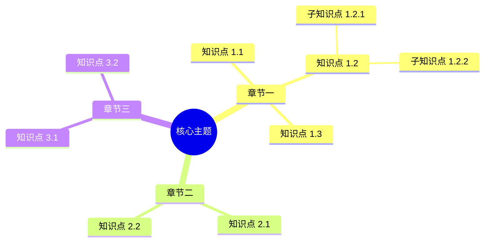

# 知识框架图

---

## 主题：[章节/科目名称]

---

## Mermaid 思维导图

---

## 结构化大纲

### 一、[章节一]
- **1.1 [知识点]**
  - 核心概念：
  - 关键公式/定理：
  - 常见题型：
- **1.2 [知识点]**
  - …

### 二、[章节二]
- **2.1 [知识点]**
  - …

---

## 知识关联表

| 节点 | 前置依赖 | 后续延伸 | 关联知识点 |
|------|---------|---------|-----------|
| A    | —       | C, D    | B         |
| B    | —       | C       | A         |
| C    | A, B    | E, F    | D         |
| D    | A       | E       | C         |
| E    | C, D    | —       | —         |
| F    | C       | —       | —         |

---

## 重点标注

- 🔴 **高频考点**：[知识点]
- 🟡 **理解难点**：[知识点]
- 🟢 **基础必备**：[知识点]

---

## 一句话总结

> [用一句话概括本章的核心思想或主线逻辑]
