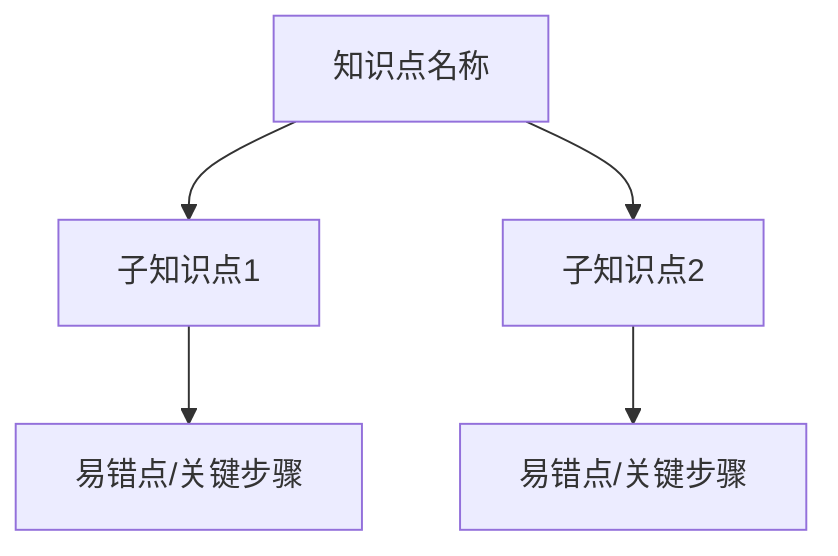

# 错题分析模板（exam 模式卡片）

## 错题卡片

```markdown
--- 错题卡片 ---
【知识点】从科目配置中提取
【错误类型】概念性/程序性/逻辑性/计算性（具体子类）
【根因】一句话说清为什么错
【正确思路】2-3 步核心步骤
【易错点】⚠️ 该题型的常见陷阱
【解题套路】该知识点下通用的解题框架（不超过 3 条）
【同类变式】一道参数改变的同类型题目（供练习）
```

## 思维导图（Mermaid）



## 输出规则

- **exam 模式**：直接输出卡片 + 导图，不输出冗长对话。
- 输出完毕后询问是否保存到 `错题集/日期-知识点.md`。
- 错误类型必须从科目配置的"常见错误类型分类"中匹配。
